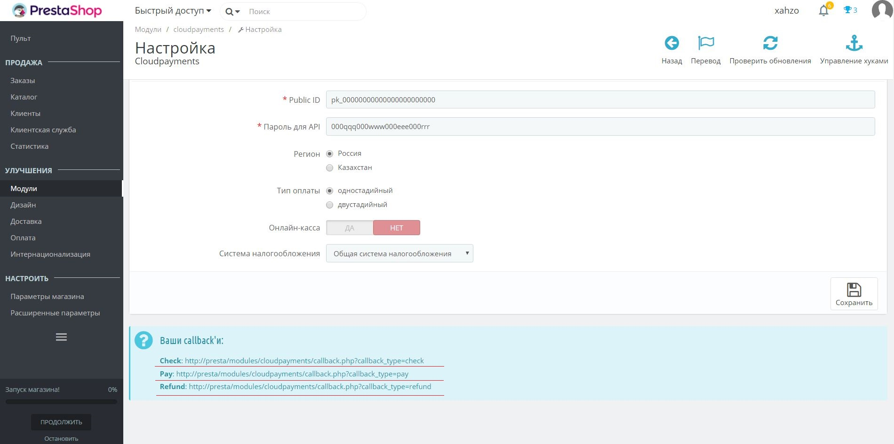

Модуль позволит с легкостью добавить на ваш сайт оплату банковскими картами через платежный сервис CloudPayments. 
Для корректной работы модуля необходима регистрация в сервисе.

Порядок регистрации описан в [документации CloudPayments](https://cloudpayments.ru/Docs/Connect)
## Возможности
	
* Одностадийная схема оплаты;  
* Двухстадийная схема оплаты;  
* Поддержка онлайн-касс (ФЗ-54);  
* Отправка чеков по email;  
* Отправка чеков по SMS;  

# Установка

Скачайте папку с модулем и заархивируйте ее (.zip).  
 

В панели управления сайтом через меню перейдите в "Модули" - "Модули и сервисы".  
 

Нажмите "Загрузить модуль", выберете архив с модулем, дождитесь загрузки и установки, затем нажмите "Настройка".  
   
 

# Настройка

В списке модулей найдите "CloudPayments" и нажмите "Установить", затем "Настроить".  
 

Введите "Public ID" и "Пароль для API" (их можно найти в Личном кабинете CloudPayments). Нажмите "Сохранить".
В личном кабинете CloudPayments зайдите в настройки сайта, пропишите ваши callback'и со страниц настроек модуля.
 
 